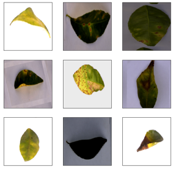

# Citrus disease

A basic [Azure Custom Ai](https://www.customvision.ai) implementation with html, CSS, and JS. It is based on three different diseases of citrus plants. These diseases are [blackspot](https://en.wikipedia.org/wiki/Citrus_black_spot), [canker](https://en.wikipedia.org/wiki/Citrus_canker), [greening](https://en.wikipedia.org/wiki/Citrus_greening_disease).
And also this app could detect a healthy plant. There are samples of the used dataset for training below.

If you want to test it [click here](https://cristianbastidas.com/PlantDiseaseCustomAi), and you could use these [sample images](samples/).
